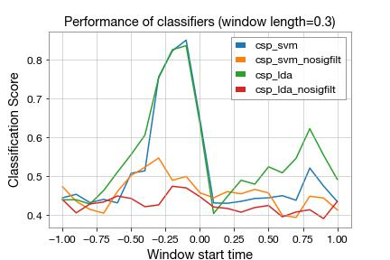

# A Machine Learning Pipeline for Gravitational Waves

On this work, we present how a feature extraction algorithm known as Common Spatial Patterns
([CSP](https://en.wikipedia.org/wiki/Common_spatial_pattern)) used widely in electroencephalography
(EEG) classifications can be used to characterize whether given (H1, L1) strain pair contains a
catalouged gravitational event.

## Dataset

The strains and timestamps for the catalogued events are provided by GW Open Science
Collaboration (GWOSC). For a baseline, we will use the same strains, except at random,
non-overlapping timestamps.

```
>>> len(event_epochs)
88
>>> len(noise_epochs)
88
>>> X = event_epochs + noise_epochs
```

`X[0]` contains H1 strain cropped to [-16s, +16s] around catalouged timestamp.
`X[1]` contains L1 strain cropped to [-16s, +16s] around catalouged timestamp.

```
>>> X[0][0].sample_rate
4096Hz
>>> len(X[0][0])
131072
```

## Procedure

On Notebook [1](./1-catalog.ipynb), we download these events from H1 (LIGO Hanford) and L1 (LIGO Livingston)
interferometers at 4096 Hz and trim them to [-16s, 16s] around their event timestamps.
On Notebook [2](./2-noise.ipynb), we will generate noise strains. Then, finally on Notebook ,
we will build a machine learning pipeline involving signal processing (Whitening + bandpass at 30-400 Hz),
feature extraction using CSP, and different classifier pipelines and run them using 10x5 cross-validation over
21 sliding windows (length 0.3s, jump 0.1s, start=-1s).

## Result

Finally, we will evaluate the performance of multiple classification pipelines.

1. `csp_svm` (Signal Filter + CSP + Support Vector Machine)
2. `csp_svm_nosigfilt` (CSP + SVM)
3. `csp_lda` (Signal Filter + CSP + Linear Descriminant Analysis)
4. `csp_lda_nosigfilt` (CSP + Linear Descriminant Analysis)

### Comparison



```

Peak classification accuracy using csp_svm: 0.8529365079365079
Peak classification accuracy using csp_svm_nosigfilt: 0.53
Peak classification accuracy using csp_lda: 0.8398571428571429
Peak classification accuracy using csp_lda_nosigfilt: 0.46750793650793654

```

The peak classification accuracy was given by `csp_svm` at 85.29%.

## Packages used

- `sklearn`
- `gwpy`
- `gwosc`
- `mne` (for CSP)
- `pandas`
- `numpy`
- `matplotlib`

## Authorship/Credits

Damodar Dahal <damodar.dahal@selu.edu> <damodar.dahal@anthem.com>

LIGO Strain Data provided by GWOSC (https://gw-openscience.org)
